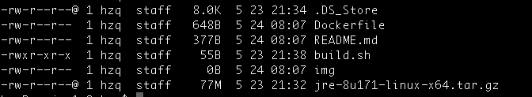

## Jre-8u171
>基于centos:7.3.1611版本构建jre镜像
## 使用说明
> 将jre1.8安装包下载放到当前目录，运行build.sh。就可以完成构建。

## Jre1.8下载地址
- [http://www.oracle.com/technetwork/java/javase/downloads/jre8-downloads-2133155.html](http://www.oracle.com/technetwork/java/javase/downloads/jre8-downloads-2133155.html)

## 镜像大小 519MB

# 下载
> docker pull mmd0308/jre8
